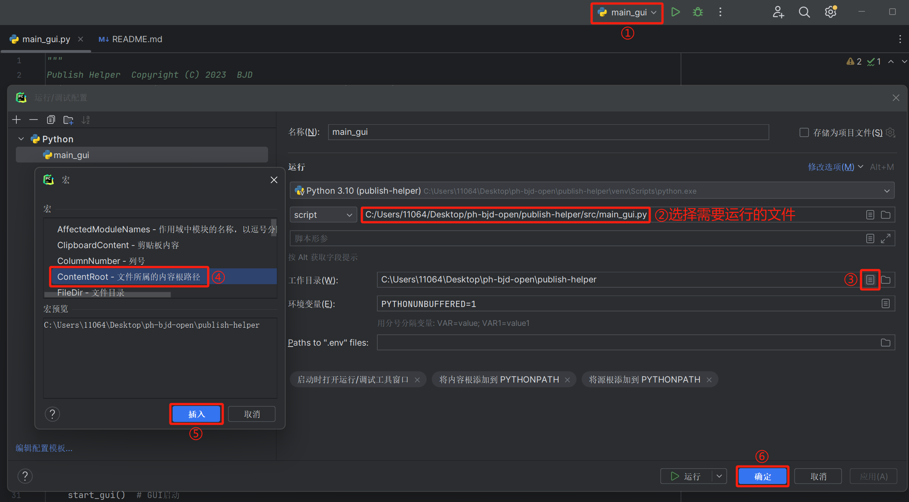

Publish Helper v1.4.6

**使用前务必请先看设置！！！**

目前的一些简单的功能有：

1. 自动获取PT-Gen简介信息（需要PT-Gen API）
2. 自动获取MediaInfo信息
3. 自动截图
4. 自动获取缩略图
5. 并上传图床（需要自行获取图床的API）
6. 根据简介信息和MediaInfo信息自动分析生成主副标题和文件名
7. 自动将资源塞入文件夹并重命名
8. 自动将资源制作种子
9. 剧集、短剧资源自动批量重命名（新）
10. 支持剧集短剧分集命名（新）
11. 自定义重命名规则（新）
12. 结合auto_feed脚本实现一键上传内容（新）
13. 短剧一键生成简介（新）

软件使用方法请见[【Wiki】](https://github.com/publish-helper/publish-helper/wiki/Publish-Helper-Wiki)。

目前支持的免费公共图床：[【freeimage】](https://freeimage.host/) [【imgbb】](https://imgbb.com/) [【imagehub】](https://www.imagehub.cc/)

目前支持的商业公共图床：[【薄荷图床(bohe)】](https://zixiaoyun.com/)

目前支持的开源图床架构：[【兰空图床(lsky-pro)】](https://github.com/lsky-org/lsky-pro) [【chevereto】](https://github.com/rodber/chevereto-free)

图床的API地址和令牌请去图床主页获取，其他图床如需要单独适配请提Issues，前提是图床支持API上传！

如果您发现自动命名时视频、音频的编码格式没有正确识别，或者想要修改资源来源、小组名称或短剧来源默认值，请参考[【Wiki】](https://github.com/publish-helper/publish-helper/wiki/Publish-Helper-Wiki)中的Q&A或查看**readme.txt**。

本软件已支持API功能，具体请见[【API文档】](https://apifox.com/apidoc/shared-6d670fb1-eb1f-4431-afdb-29b19fe1ffe1)。

**软件获取地址：**

[【GitHub仓库】](https://github.com/publish-helper/publish-helper/releases) [【Gitee仓库】](https://gitee.com/publish-helper/publish-helper/releases)

更新时只需要保留static文件夹即可将配置完美迁移。

如果出现错误，可能是配置文件结构有重大变化，请使用最新的static文件。

如有帮助到您，请给项目**点亮Star**，并推广给有需要的朋友，十分感谢！

**Powered by Python 3.10**

**Created by BJD**


# 快速开始

### 依赖安装

```
pip install -r requirements.txt
```

### 项目启动

在项目根目录（README文件所在目录）下执行代码。

* 1.gui启动
  * Unix
    ```shell
    export PYTHONPATH=${PYTHONPATH}:. && python src/main_gui.py
    ```
  * Windows
    ```shell
    $env:PYTHONPATH = "$($env:PYTHONPATH);."
    python src\main_gui.py
    ```

* 2.api启动
  * Unix
    ```shell
    export PYTHONPATH=${PYTHONPATH}:. && python src/main.py
    ```
  * Windows
    ```shell
    $env:PYTHONPATH = "$($env:PYTHONPATH);."
    python src\main.py
    ```

* 3.pycharm下启动

配置默认工作目录为项目根目录，随后运行对应按钮即可。


## 附件

- [镜像发布](docs/docker_publish.md)